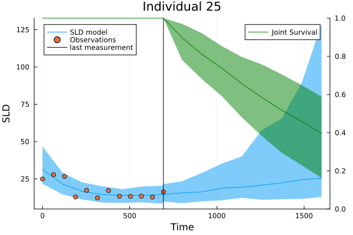

# Summary
This software implements a numerical approach to define a distribution based on the description of the hazard function from survival analysis. In particular this allows to define joint models of time-to-even data and longitudinal measurements. Using numerical integration, the likelihood of events can be calculated, allowing Bayesian inference frameworks to sample the posterior distribution of the model's parameters. Additionally, this implementation is able to generate samples of joint models. This allows its use in simulations, which are common in Bayesian workflows [@BayesianWorkflow].


# Statement of need

Over the last decade, there has been a growing interest in joint models for longitudinal and time-to-event outcome data. This is the case in clinical research where biomarkers are often measured repeatedly over time, with the expectation that they may provide insights into the likelihood of a long-term clinical outcome (such as death). As a consequence, joint models have been proposed to leverage this data and used for the prediction of individual risks, the evaluation of surrogacy of a biomarker for a clinical outcome, and for making inferences about treatment in various therapeutic areas.

In oncology, it is well known that the individual risk of death depends on the treatment-induced changes in tumor size over time [@Tardivon2019]. Because pharmacologic effects are typically transient, nonlinear mixed-effect models are required to capture central tendency and inter-individual variability in tumor size, while parametric models can be used for analysing time to death. Joint models have been used in other therapeutic areas such as neurology [Khnel2021], cardiovascular disease [KassahunYimer2020], or infection diseases [@Wu2007].

The current landscape of open-source software allowing end-users to easily fit and use joint models consists primarily of R packages such as JMbayes [@JMbayes], rstanarm [@rstanarm], joineR [@joineR], or JM [@JM]. These packages typically limit the longitudinal model to linear forms (for the parameters) preventing users from fitting joint models with saturating biological processes resulting in nonlinear profiles for the biomarker.
In contrast, the present software supports fitting any longitudinal and survival model, provided the joint model fulfills continuity and certain smoothness characteristics for numerical procedures. Such flexibility is crucial for studying complex biological processes.

# Formulation


To build a joint model, we augment the survival analysis hazard function $h(t) = \lim_{\delta \to 0} P(t\leq T\leq t+\delta | T \geq t)/\delta$ by incorporating a link $l$ to a longitudinal process. The longitudinal process is modeled by a function $m:\mathbb{R} \to \mathbb{R}$, for example a non-linear mixed effects model [@Kerioui2020]. Let the function $h_0:\mathbb{R} \to \mathbb{R}$ describe a baseline hazard and $\gamma\in\mathbb{R}$ be a coefficient of the link contribution. The hazard of the joint model is

$$ h(t) = h_0(t) \exp(\gamma\cdot l(m(t))).$$

The link $l$ is not a function over the reals. In general, the link is an operator on the longitudinal models. Some examples of links such as $l(m(t)) = (l \circ m)(t)$ are given in [@Kerioui2020] such as the derivative $\frac{d}{dt} m(t)$ or integral $\int_0^t m(u) \, du$ operators.


Now we extend this idea to multiple longitudinal models. Suppose that we have $k\in \mathbb{N}$ longitudinal models $\{m_{1},\dots, m_{k}\}$ as well as $k$ link functions $\{l_{1},\dots, l_{k}\}$. Let $M: \mathbb{R} \to \mathbb{R}^k$ and $L:\mathbb{R}^k \to \mathbb{R}^k$ be the vector of functions

$$
    M(t) \mapsto \begin{pmatrix}
    m_{1}(t) \\ m_{2}(t) \\ \dots \\ m_{k}(t)
\end{pmatrix} \text{, }
    L\begin{pmatrix}
    \mu_1 \\ \mu_2 \\ \dots \\ \mu_k
\end{pmatrix} \mapsto \begin{pmatrix}
    l_1(\mu_1) \\ l_2(\mu_2) \\ \dots \\ l_k(\mu_k)
\end{pmatrix} 
$$
and together
$$L(M(t)) =\begin{pmatrix}
    l_1(m_{1}(t)) \\ l_2(m_{2}(t)) \\ \dots \\ l_k(m_{k}(t))
\end{pmatrix}.$$

For the link vector $L(M(t))$ we consider the coefficient vector $\gamma \in \mathbb{R}^k$. Then we formulate the hazard as follows.

$$h(t) = h_0(t) \exp\left(\sum_{j\in [k]}\gamma_{j} l_j(m_{j}(t))  \right) = h_0(t) \exp(\gamma^\top \cdot L(M(t))).$$

In addition, we consider covariates $x\in \mathbb{R}^l, l\in\mathbb{N}$ and coefficients $\beta \in \mathbb{R}^l$. This results in the hazard
$$h(t) = h_0(t) \exp\left(\gamma^\top \cdot L(M(t)) +  \beta^\top \cdot x \right).$$

The probability density function in survival analysis can be described by
$$f(t) = h(t) \exp\left(-\int_0^t h(u) \, du\right).$$
Note for nonlinear longitudinal models $\int_0^t h(u) \, du$ generally does not have a analytic form, thus numerical integration is required.


## Likelihood calculations

Suppose that we have $n\in \mathbb{N}$ individuals. For each individual $i\in [n]=\{1,\dots, n\}$ we observe $n_i \in \mathbb{N}$ different longitudinal measurements $\{y_{i1}, \dots, y_{in_i}\}\subseteq \mathbb{R}$ at associated time points $\{t_{i1}, \dots, t_{in_i}\}\subseteq \mathbb{R}$ at which the measurements were recorded. In addition, we measure an event time $\tau_i \in \mathbb{R}$ and an event indicator $\delta_i \in \{0,1\}$. Without loss of generality we will consider right-censored data; this can be adapted to other censoring processes. Let $Y_i := (\tau_i,\delta_i,(y_{i1}, \dots, y_{in_i}),(t_{i1}, \dots, t_{in_i}))$ be the measurements associated with individual $i\in [n]$ and $Y = \{Y_1, \dots, Y_n\}$ all observations.

We denote the parameters for the joint model with $\theta =(\theta_H, \theta_J, \theta_L)$, where $\theta_H$ describes the parameters for the baseline hazard, $\theta_J$ for the joint model, and $\theta_L$ for longitudinal models. The likelihood of the joint model is comprised of the likelihood of the survival measurements and the longitudinal measurements.

$$\log L(Y | \theta) \propto \sum_{i\in[n]} \log ( L((\tau_i, \delta_i) | \theta)) +  \sum_{i\in[n], j\in[n_i]} \log( L(t_{ij},y_{ij} | \theta_L) )$$

For individual $i\in[n]$ let $f_i, S_i$ be the joint probability density function and survival function. The likelihood depends on the censoring process, for example for right-censored measurements $(\tau_i, \delta_i)$ is given by

$$\log ( L((\tau_i, \delta_i) | \theta)) = \delta_i \log(f_i(\tau_i)) - (1-\delta_i)\int_0^{\tau_i} h_i(u) du$$

For the longitudinal model, the likelihood depends on the error process you use. Let $p_{m_i(t_{ij})}$ be the probability density function for measurements for model $m_i$ at time $t_{ij}$ for a given error, for example, the standard error or a multiplicative error. Then the longitudinal likelihood is given by

$$\log( L(t_{ij},y_{ij} | \theta_L)) = \log(p_{m_i(t_{ij})}(y_{ij}))$$


# Example

The following example showcases the simplicity and similarity to the mathematical description of the model that is achieved for the modeling of non-linear joint models using `JointModels.jl`. The code can be found in the [example](https://github.com/insightsengineering/JointModels.jl/tree/main/example) folder in the project repository. It follows the simulation study by [@Kerioui2020]. They specify a longitudinal model for $\Psi = (\text{BSLD}, g, d, \phi) \in \mathbb{R}^4$ as

$$\text{SLD}(t,\Psi) = \begin{cases}
    \text{BSLD}\exp(gt) & t < t_x \\
    \text{BSLD}\exp(gt_x) (\phi \exp(-d(t-t_x)) + (1-\phi)\exp(g(t-t_x))) & t \geq t_x.
\end{cases}$$

In code:

```julia
function sld(t, Ψ, tx = 0.0)
    BSLD, g, d, φ = Ψ
    Δt = t - tx
    if t < tx
        return BSLD * exp(g * t)
    else
        return BSLD * exp(g * tx) * (φ * exp(-d * Δt) + (1 - φ) * exp(g * Δt))
    end
end
```

They use a baseline Weibull hazard $h_0(t) =\kappa / \lambda * (t/\lambda)^{\kappa-1}$ and the identity function as link.

```julia
h_0(t, κ, λ) = κ/λ * (t/λ)^(κ - 1)
```

The parameters $\Psi$ for the longitudinal model depend on the individual $i$ resulting in the joint hazard

$$h_i(t) = h_0(t) \exp(b * \text{SLD}(t, \Psi_i)).$$

In code the distribution of the joint model defined by this hazard is given by:
```julia
my_jm(κ, λ, γ, Ψ_i, tx) = JointModel(t -> h_0(t, κ, λ), γ, t -> sld(t, Ψ_i, tx))
```

The mixed effects model contains population parameters $\mu = (\mu_{\text{BSLD}},\mu_d, \mu_g, \mu_\phi)$ and mixed effects $\eta_i = (\eta_{\text{BSLD},i},\eta_{d,i}, \eta_{g,i}, \eta_{\phi,i})$ which are normally distributed around zero $\eta_i \sim N(0, \Omega), \Omega = (\omega_{\text{BSLD}}^2,\omega_d^2, \omega_g^2, \omega_\phi^2)$. For biological constraints, the parameters were transformed such that $\phi_q(\Psi_{q,i}) = \phi_q\mu_q + \eta_{q,i}$ for $q\in \{\text{BSLD}, d, g, \phi\}$. For $\text{BSLD}, g, d$ a log-normal $(\phi = log)$ transform was assumed and for $\phi$ a logit-normal $(\sigma = \text{logit})$.

With this information, a Bayesian model can be specified in `Turing.jl` [@Turing.jl] by giving prior distributions for the parameters and calculations for the likelihood. To calculate the likelihood of the survival time and event indicator the software is used. This results in a canonical translation of the statistical ideas into code. For longitudinal data, a multiplicative error model is used using $e_{ij} \sim N(0, \sigma^2)$ given by $y_{ij} = \text{SLD}(t_{ij},\Psi_i)(1+e_{ij})$ is used. The model and prior setup from [@Kerioui2020] can be implemented as follows in code:

```julia
@model function identity_link(longit_ids, longit_times, longit_measurements, 
                                  surv_ids, surv_times, surv_event)
    # treatment at study start
    tx = 0.0
    # number of longitudinal and survival measurements
    n = length(surv_ids)
    m = length(longit_ids)

    # ---------------- Priors -----------------
    ## priors longitudinal
    # μ priors, population parameters
    μ_BSLD ~ LogNormal(3.5,1)
    μ_d ~ Beta(1,100)
    μ_g ~ Beta(1,100)
    μ_φ ~ Beta(2,4)
    μ = (BSLD = μ_BSLD, d = μ_d, g = μ_g, φ = μ_φ)
    # ω priors, mixed/individual effects
    ω_BSLD ~ LogNormal(0,1)
    ω_d ~ LogNormal(0,1)
    ω_g ~ LogNormal(0,1)
    ω_φ ~ LogNormal(0,1)
    Ω = (BSLD = ω_BSLD^2, d = ω_d^2, g = ω_g^2, φ = ω_φ^2)
    # multiplicative error
    σ ~ LogNormal(0,1)
    ## priors survival
    κ ~ truncated(LogNormal(0,1),0.8,1.2)
    λ ~ LogNormal(5,1)
    
    ## prior joint model
    γ ~ truncated(Normal(0,0.5),-0.1,0.1)
    
    ## η describing the mixed effects of the population
    η_BSLD ~ filldist(Normal(0,Ω.BSLD),n)
    η_d ~ filldist(Normal(0,Ω.d),n)
    η_g ~ filldist(Normal(0,Ω.g),n)
    η_φ ~ filldist(Normal(0,Ω.φ),n)
    η = [(BSLD=η_BSLD[i], d=η_d[i], g=η_g[i], φ=η_φ[i]) for i in 1:n]
    # Transforms
    Ψ = [[μ_BSLD * exp(η_BSLD[i]),
    μ_g * exp(η_g[i]),
    μ_d * exp(η_d[i]),
    inverse(logit)(logit(μ_φ) + (η_φ[i]))]
    for i in 1:n]

    # ---------------- Likelihoods -----------------
    # add the likelihood of the longitudinal process
    for data in 1:m
        id = Int(longit_ids[data])
        meas_time = longit_times[data]
        sld_prediction = sld(meas_time, Ψ[id], tx)
        if isnan(sld_prediction) || sld_prediction < 0
            sld_prediction = 0
        end
        longit_measurements[data] ~ Normal(sld_prediction, sld_prediction * σ)
    end
    # add the likelihood of the survival model with link
    baseline_hazard(t) = h_0(t, κ, λ)
    for i in 1:n
        id = Int(surv_ids[i])
        id_link(t) = sld(t, Ψ[id], tx)
        censoring = Bool(surv_event[id]) ? Inf : surv_times[id]
        # here we use the JointModel
        surv_times[i] ~ censored(
            JointModel(baseline_hazard, γ, id_link),
            upper = censoring
        )
    end
end
```
When sampling the posterior the log probability density function of the joint model is called conditioned on specific parameters. The numerical calculation of the likelihood is then used in the sampling process. Sampling with the NUTS algorithm 400 posterior samples using 200 burn-in results in posterior statistic:

```
parameters        mean        std      mcse       rhat  |  ture_parameters    
    Symbol     Float64    Float64   Float64    Float64  |       

    μ_BSLD     62.1952     4.8282    0.7664     1.0096  |        60
       μ_d      0.0056     0.0015    0.0002     1.0473  |         0.0055 
       μ_g      0.0017     0.0003    0.0000     0.9986  |         0.0015
       μ_φ      0.1807     0.0615    0.0079     1.0066  |         0.2
         σ      0.1768     0.0063    0.0006     1.0283  |         0.18
         κ      1.0815     0.0762    0.0033     1.0028  |         1
         λ   1393.6532   286.6294   15.9133     0.0059  |      1450
         γ      0.0103     0.0012    0.0001     0.0005  |         0.01
```
Notice that the link coefficient $\gamma$ was sampled around the true value with a narrow variance. In general the survival parameters are well represented by the posterior samples. The mixed effects model parameters as well indicated by the $\hat r$ value which is close to one, with the potential exception of $\mu_d$.


Additionally, `JointModels.jl` implements the generation of random samples of a joint distribution which enables `Turing.jl` [@Turing.jl] to sample a joint distribution. This allows to create posterior predictive checks or simulations, which are a major step in a Bayesian workflow when validating a model [@BayesianWorkflow]. 

{ width=80% }


The figure \autoref{fig:ind_pred} showcases posterior predictions for the mixed effects longitudinal sub model along side the longitudinal observations for a specific individual. The figure also shows the individual survival predictions conditioned on survival until the last measurement based on the joint survival distribution. The light colored ribbons represent the 95% quantile of the posterior predictions while the line represents the median. To create the posterior predictions the above `Turing.jl` [@Turing.jl] model was used.


# Acknowledgements

# References


<!--

# Summary

The forces on stars, galaxies, and dark matter under external gravitational
fields lead to the dynamical evolution of structures in the universe. The orbits
of these bodies are therefore key to understanding the formation, history, and
future state of galaxies. The field of "galactic dynamics," which aims to model
the gravitating components of galaxies to study their structure and evolution,
is now well-established, commonly taught, and frequently used in astronomy.
Aside from toy problems and demonstrations, the majority of problems require
efficient numerical tools, many of which require the same base code (e.g., for
performing numerical orbit integration).

# Statement of need

`Gala` is an Astropy-affiliated Python package for galactic dynamics. Python
enables wrapping low-level languages (e.g., C) for speed without losing
flexibility or ease-of-use in the user-interface. The API for `Gala` was
designed to provide a class-based and user-friendly interface to fast (C or
Cython-optimized) implementations of common operations such as gravitational
potential and force evaluation, orbit integration, dynamical transformations,
and chaos indicators for nonlinear dynamics. `Gala` also relies heavily on and
interfaces well with the implementations of physical units and astronomical
coordinate systems in the `Astropy` package [@astropy] (`astropy.units` and
`astropy.coordinates`).

`Gala` was designed to be used by both astronomical researchers and by
students in courses on gravitational dynamics or astronomy. It has already been
used in a number of scientific publications [@Pearson:2017] and has also been
used in graduate courses on Galactic dynamics to, e.g., provide interactive
visualizations of textbook material [@Binney:2008]. The combination of speed,
design, and support for Astropy functionality in `Gala` will enable exciting
scientific explorations of forthcoming data releases from the *Gaia* mission
[@gaia] by students and experts alike.

# Mathematics

Single dollars ($) are required for inline mathematics e.g. $f(x) = e^{\pi/x}$

Double dollars make self-standing equations:

$$\Theta(x) = \left\{\begin{array}{l}
0\textrm{ if } x < 0\cr
1\textrm{ else}
\end{array}\right.$$

You can also use plain \LaTeX for equations
\begin{equation}\label{eq:fourier}
\hat f(\omega) = \int_{-\infty}^{\infty} f(x) e^{i\omega x} dx
\end{equation}
and refer to \autoref{eq:fourier} from text.

# Citations

Citations to entries in paper.bib should be in
[rMarkdown](http://rmarkdown.rstudio.com/authoring_bibliographies_and_citations.html)
format.

If you want to cite a software repository URL (e.g. something on GitHub without a preferred
citation) then you can do it with the example BibTeX entry below for @fidgit.

For a quick reference, the following citation commands can be used:
- `@author:2001`  ->  "Author et al. (2001)"
- `[@author:2001]` -> "(Author et al., 2001)"
- `[@author1:2001; @author2:2001]` -> "(Author1 et al., 2001; Author2 et al., 2002)"

# Figures

Figures can be included like this:

and referenced from text using \autoref{fig:example}.

Figure sizes can be customized by adding an optional second parameter:
{ width=20% }


We acknowledge contributions from Brigitta Sipocz, Syrtis Major, and Semyeong
Oh, and support from Kathryn Johnston during the genesis of this project.

-->
